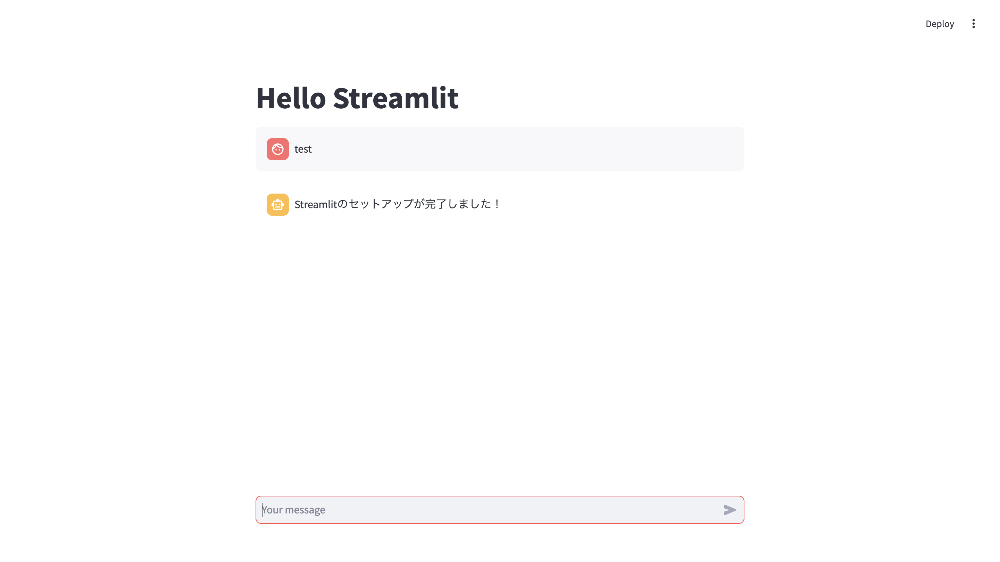

# training-llm-application-development-starter

LLM アプリケーション開発者養成講座のハンズオン環境構築のためのリポジトリです。

## ハンズオン環境への接続

AWS の EC2 インスタンスで code-server (ブラウザ上で動作する Visual Studio Code) を使うハンズオン環境を使用します。


ハンズオン環境には付与された接続情報で接続するか、[こちら](./docs/ec2_code_server.md) の手順で構築してください。

## .env ファイルの作成

.env.template をコピーして .env ファイルを作成してください。

.env ファイルには OpenAI API キーを記載してください。

## Jupyter の動作確認

「notebooks/hello.ipynb」を開いてください。


セルにフォーカスして実行 (Shift + Enter) すると、「Select Kernel」というメニューが開きます。
「Python Environments...」を選択してください。


Python の環境として「.venv (venv/bin/python)」を選択してください。


その後、「hello.ipynb」の内容が想定通り動作するか確認してください。


## Streamlit の起動

画面左のメニューボタン (≡) をクリックし、「ターミナル」>「新しいターミナル」でターミナルを開くことができます。


以下のコマンドで Streamlit を起動してください。

```console
make streamlit
```

> [!INFO]
> Streamlit の起動時に Email の入力が求められた場合、入力せず空のまま Enter で進めてください。

ターミナル上で Web アプリケーション等を起動した場合、画面右下に表示される「Open in Browser」をクリックするとプレビューできます。


または、`https://<ランダムな文字列>.cloudfront.net/proxy/<ポート番号>/` にアクセスすることでも、Web アプリケーションのプレビューが可能です。

Streamlit のアプリケーションにアクセスしたら、下部の入力欄に適当な入力をして、応答が表示されるか確認してください。



これでハンズオン環境の準備は完了です。

### 補足: Streamlitの停止

Streamlit がすでに起動している場合、`make streamlit` を実行すると以下のエラーが発生します。
```
$ make streamlit
uv run streamlit run app.py --server.port 8080
2025-03-04 20:40:42.479 Port 8080 is already in use
make: *** [streamlit] Error 1
```

この場合は、`pkill streamlit` を実行して Streamlit を停止してください。
