# EC2 インスタンスでの code-server 環境セットアップ手順

AWS の EC2 インスタンスで code-server (ブラウザ上で動作する Visual Studio Code) を使うハンズオン環境のセットアップ手順です。

> [!WARNING]
> この手順では、デフォルトで c7i.large の EC2 インスタンスを起動します。
> このインスタンスを起動し続けると、1 日あたり 2.7 ドル程度、1 ヶ月で 80 ドル程度の料金が発生します。ハンズオンが終了したら環境を停止または削除するようにしてください。

## 目次

- [環境構築手順](#環境構築手順)
- [複数の環境を構築するには](#複数の環境を構築するには)
- [トラブルシューティング](#トラブルシューティング)
- [停止・削除手順](#停止・削除手順)
- [基本操作](#基本操作)
- [参考](#参考)

## 環境構築手順

### 1. CloudFormation スタックの作成

マネジメントコンソール上部の検索欄で「CloudFormation」を検索して開きます。

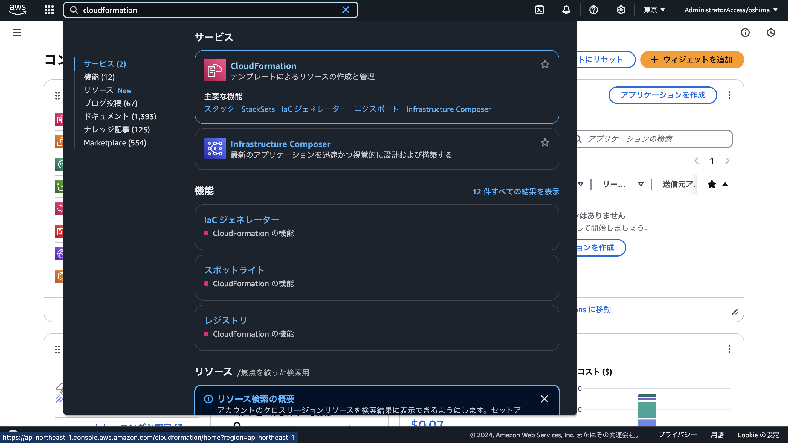

> [!NOTE]
> 日本に在住の場合、マネジメントコンソール右上で「東京」リージョンを選択することで、開発環境を快適に使用することができます。

CloudFormation のホーム画面左のメニューから「スタック」を開き、「スタックの作成」を選択します。

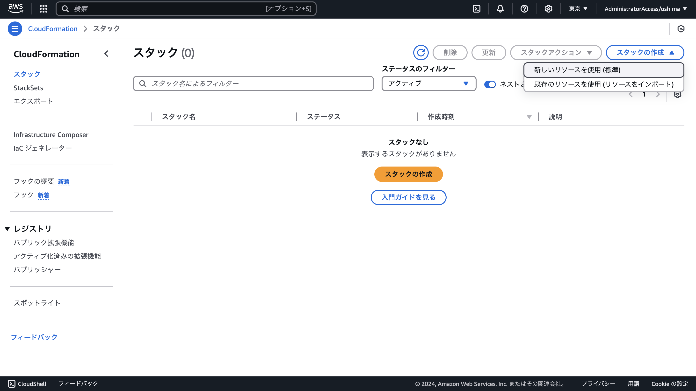

[ec2_code_server.yaml](ec2_code_server.yaml) をダウンロードします。

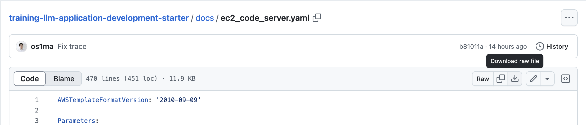

「スタックの作成」画面で ec2_code_server.yaml をアップロードして次に進みます。

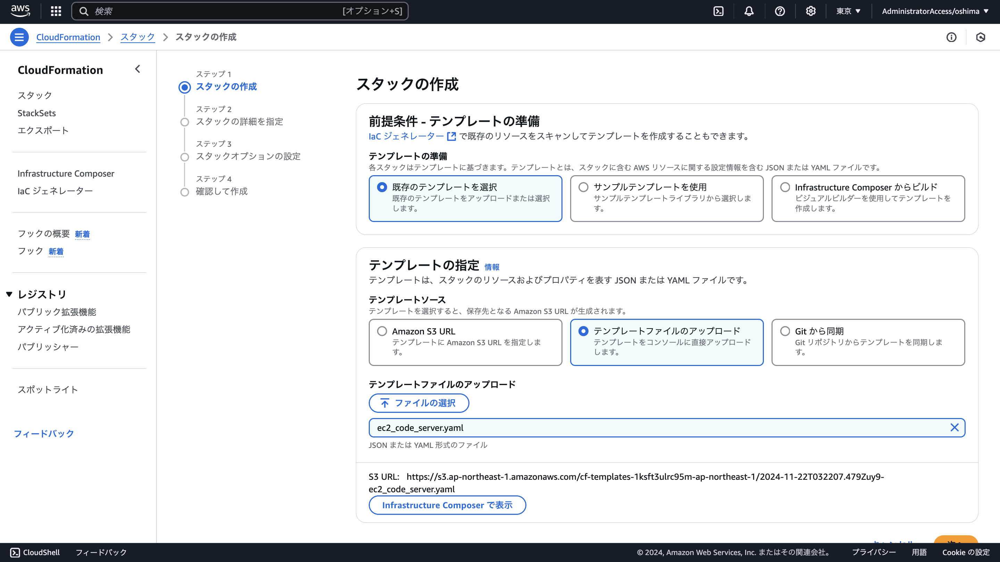

スタック名を適当につけて、その他の設定はデフォルトのままで、作成まで進めます。

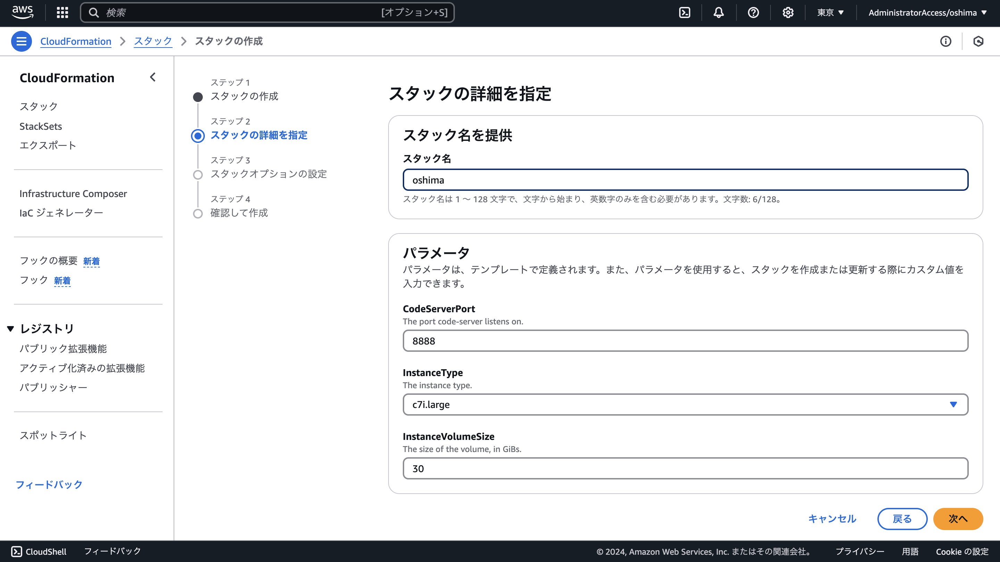

最後に IAM リソースが作成されることを承認するチェックボックスにチェックが必要です。

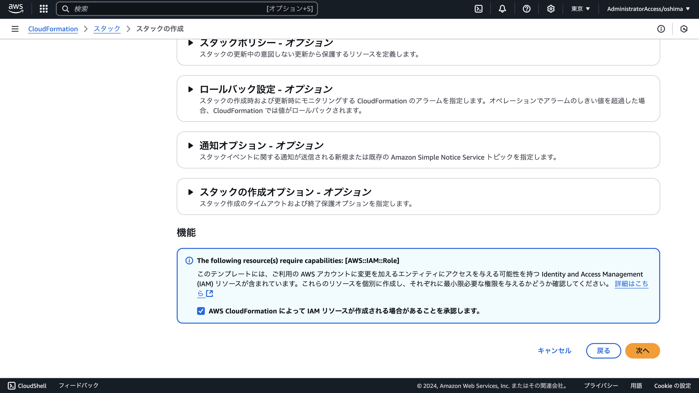

5 分〜10 分ほどで、スタックの作成が完了します。

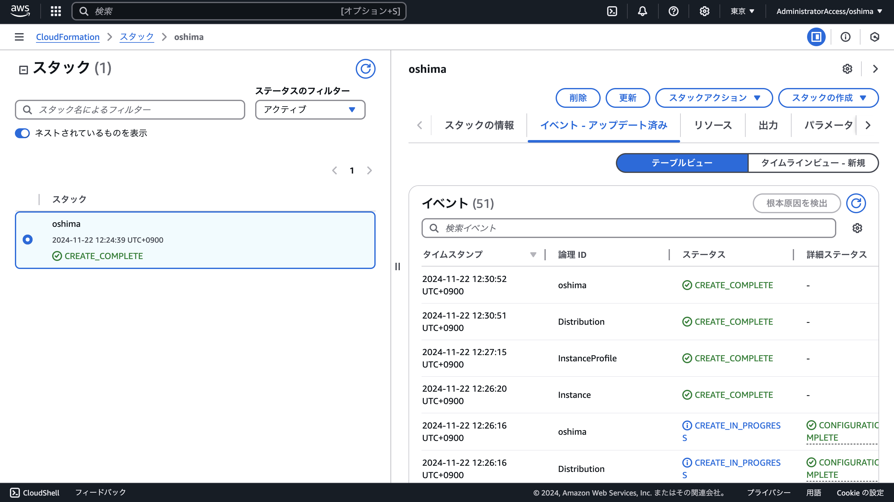

> [!WARNING]
> AWS のハンズオンでは、AWS CLI や CDK、Terraform、Serverless Framework などのツールを使用するために、開発環境に非常に強い権限が必要なことが多いです。
> そのため、この手順で構築される EC2 インスタンスには AdministratorAccess の権限を付与しています。

### code-server への接続

作成が完了したスタックの「出力」を開きます。

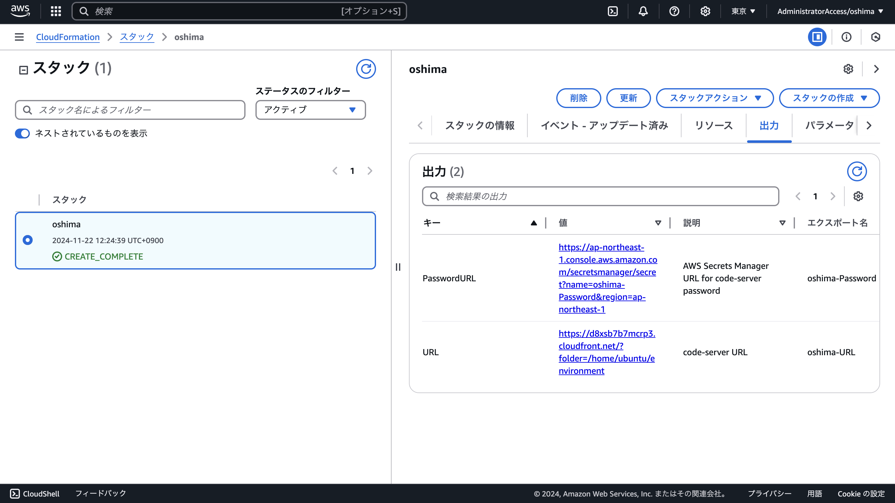

「PasswordURL」にアクセスし、「シークレットの値を取得する」をクリックしてパスワードを確認してコピーします。

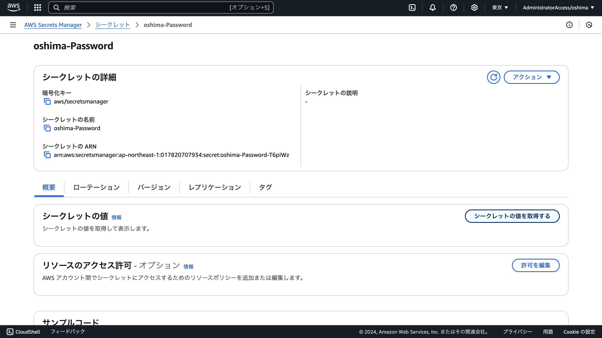

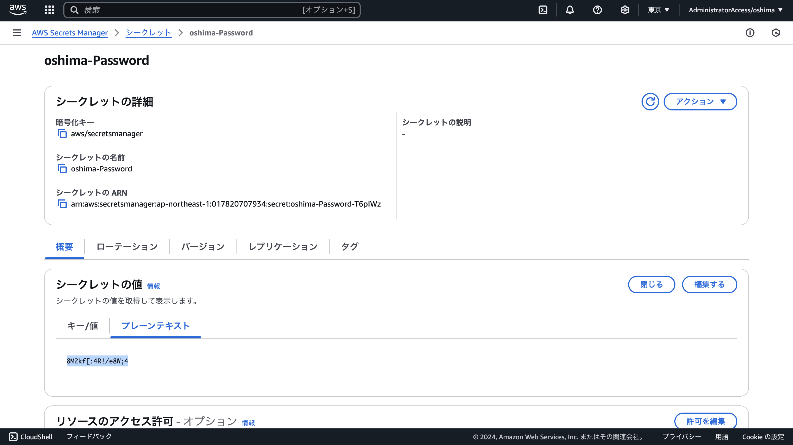

CloudFormation のスタックの出力の「URL」にアクセスし、コピーしたパスワードを入力します。

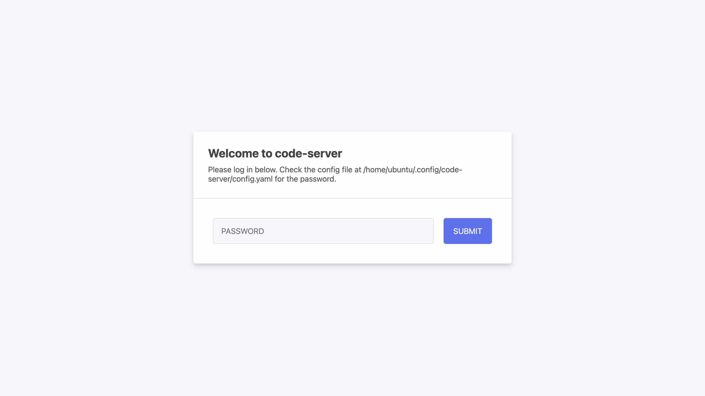

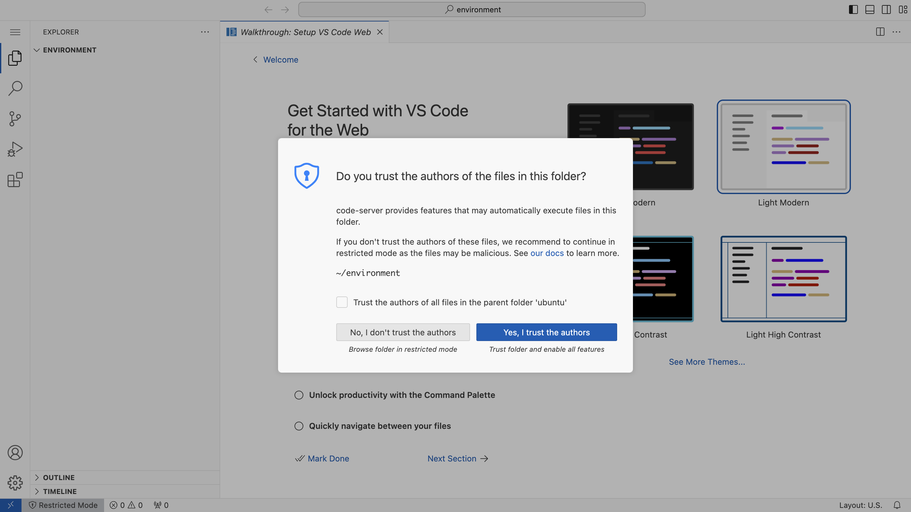

> [!NOTE]
> パスワードはスタックを作成するたびに異なります。

「Yes, I trust the authors」をクリックすると開発環境が使用可能になります。

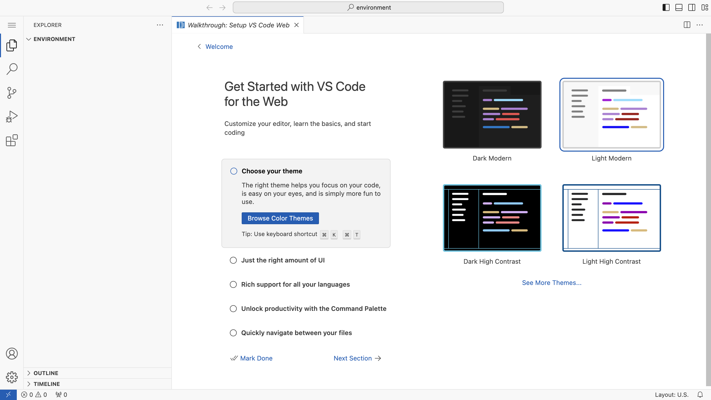

## 複数の環境を構築するには

AWS CloudShell で以下のコマンドを実行することで、複数の環境を作成できます。

```console
curl -sSfLO https://raw.githubusercontent.com/GenerativeAgents/training-llm-application-development-starter/refs/heads/main/docs/ec2_code_server.yaml

for i in {01..05}; do
  aws cloudformation create-stack \
    --stack-name "code-server-${i}" \
    --template-body "file://$(pwd)/ec2_code_server.yaml" \
    --capabilities CAPABILITY_IAM \
    --parameters "ParameterKey=AvailabilityZone,ParameterValue=ap-northeast-1a"
done
```

> [!WARNING]
> 同一の AWS アカウントでは、デフォルトで最大5つの環境を起動することができます。
>
> それ以上多くの環境を起動するためには、以下のクォータの引き上げが必要な可能性があります。
>
> - VPCs per Region
> - Running On-Demand Standard (A, C, D, H, I, M, R, T, Z) instances
>
> 参考: https://docs.aws.amazon.com/ja_jp/vpc/latest/userguide/amazon-vpc-limits.html

以下のコマンドで、接続情報の一覧を取得できます。

```console
stack_names="$(aws cloudformation list-stacks \
  --query 'StackSummaries[?starts_with(StackName, `code-server-`) && StackStatus != `DELETE_COMPLETE`].StackName' \
  --output text \
  | tr '\t' '\n' \
  | sort
)"

for stack_name in $stack_names; do
  echo "Name:"
  echo "${stack_name}"

  echo "URL:"
  aws cloudformation describe-stacks \
    --stack-name $stack_name \
    --query 'Stacks[].Outputs[?OutputKey==`URL`].OutputValue' \
    | jq -r .[][]

  echo "Password:"
  aws secretsmanager get-secret-value \
    --secret-id "${stack_name}-Password" \
    --region ap-northeast-1 \
    --query 'SecretString' \
    --output text

  echo
done
```

## トラブルシューティング

### EC2 インスタンスへの接続

トラブルシューティングのため、起動した EC2 インスタンスには「Systems Manager」の「セッションマネージャー」でも接続できます。

マネジメントコンソール上部の検索欄で「Systems Manager」を検索して開きます。

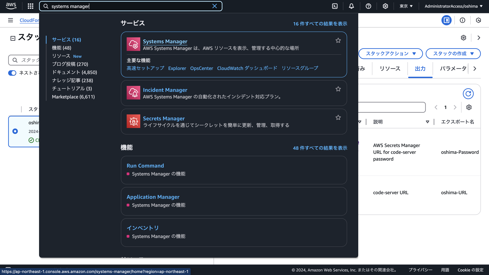

Systems Manager のホーム画面左のメニューから「セッションマネージャー」を開き、「セッションの開始」をクリックします。

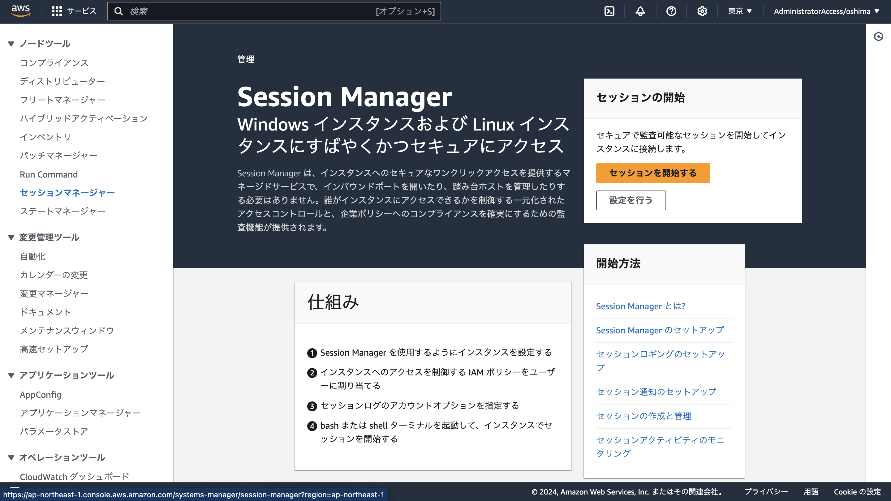

「ターゲットインスタンス」で該当の EC2 インスタンスを選択して、「Start session」をクリックすると、ブラウザ上で EC2 インスタンスに接続できます。

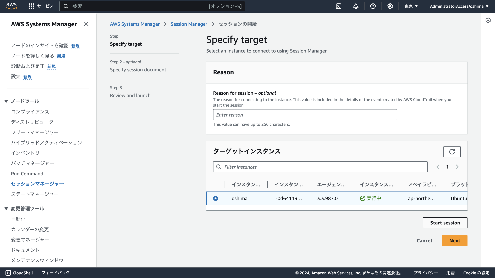

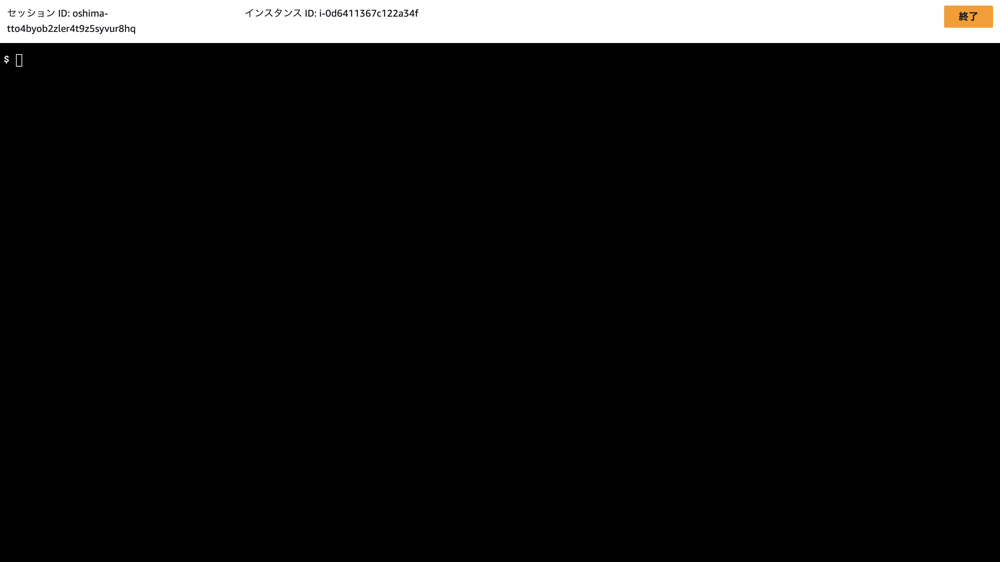

### CloudShell からの EC2 インスタンスへの接続手順

CloudShell で以下のコマンドを実行することでも、EC2 インスタンスに接続できます。

**インタラクティブ操作する場合**

```
stack_name="code-server-01"

instance_id="$(aws ec2 describe-instances \
  --filters "Name=tag:Name,Values=${stack_name}" \
  --query "Reservations[].Instances[].InstanceId" \
  --output text \
)"

# インタラクティブ操作する場合
aws ssm start-session --target "${instance_id}"
```

**1つだけコマンドを実行する場合 (git pull する例)**

```
stack_name="code-server-01"

instance_id="$(aws ec2 describe-instances \
  --filters "Name=tag:Name,Values=${stack_name}" \
  --query "Reservations[].Instances[].InstanceId" \
  --output text \
)"

# 1つだけコマンドを実行する場合 (git pull する例)
aws ssm start-session --target "${instance_id}" \
  --document-name AWS-StartInteractiveCommand \
  --parameters command="sudo -u ubuntu git -C /home/ubuntu/environment/training-llm-application-development-starter pull"
```

### 起動時のスクリプトのログ確認手順

EC2 インスタンスでは、起動時のスクリプト (ユーザーデータ) で code-server のインストールなどを実施しています。

以下のコマンドで起動時のスクリプトのログを確認することができます。

```console
cat /var/log/cloud-init-output.log
```

### 起動時のスクリプトを実行し直すには

以下のコマンドで起動時のスクリプトを実行し直すことができます。

```console
curl -s http://169.254.169.254/latest/user-data | sudo bash
```

> [!WARNING]
> このコマンドは code-server のターミナルで実行せず、セッションマネージャーから実行してください。

## 停止・削除手順

構築した開発環境を使わないときは、「EC2 インスタンスの停止」または「CloudFormation スタックの削除」により、料金を削減することができます。

### EC2 インスタンスの停止手順

マネジメントコンソール上部の検索欄で「EC2」を検索して開きます。

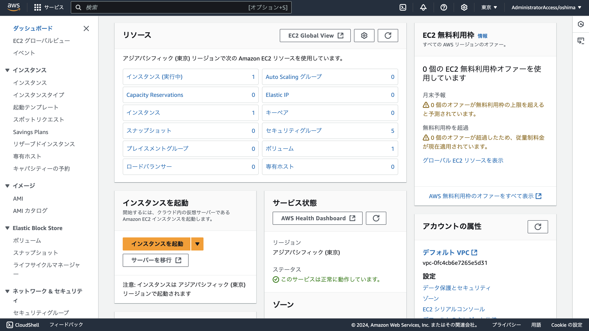

EC2 のホーム画面左のメニューから「インスタンス」を開き、EC2 インスタンスを選択して、「インスタンスの状態」から「インスタンスの停止」を実行します。

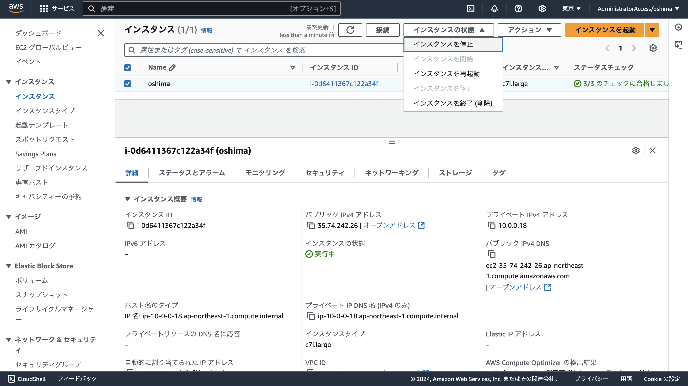

> [!WARNING]
> EC2 インスタンスを停止しても、データを保存するストレージ (EBS) は確保したままのため、ストレージの料金は発生し続けます。
> 完全に料金が発生しないようにするには、次の手順で「削除」を実施する必要があります。

### EC2 インスタンス再起動時の注意事項

EC2 インスタンスを停止後に再起動すると、パブリック IP アドレスが変更されるため、CloudFront の Origin 設定を更新する必要があります。

以下のスクリプトを使用して CloudFront の Origin を自動的に更新できます：

```bash
# update_cloudfront_origin.sh をダウンロード
curl -sSfLO https://raw.githubusercontent.com/GenerativeAgents/training-llm-application-development-starter/refs/heads/main/docs/update_cloudfront_origin.sh

# 実行権限を付与
chmod +x update_cloudfront_origin.sh

# CloudFront Origin を更新（スタック名を指定）
./update_cloudfront_origin.sh <スタック名>
```

例：
```bash
./update_cloudfront_origin.sh code-server-01
```

> [!NOTE]
> CloudFront の変更が反映されるまで約 5 分かかります。

### CloudFormation スタックの削除手順

マネジメントコンソール上部の検索欄で「CloudFormation」を検索して開きます。

CloudFormation のホーム画面左のメニューから「スタック」を開き、スタックを選択して、「削除」を実行します。

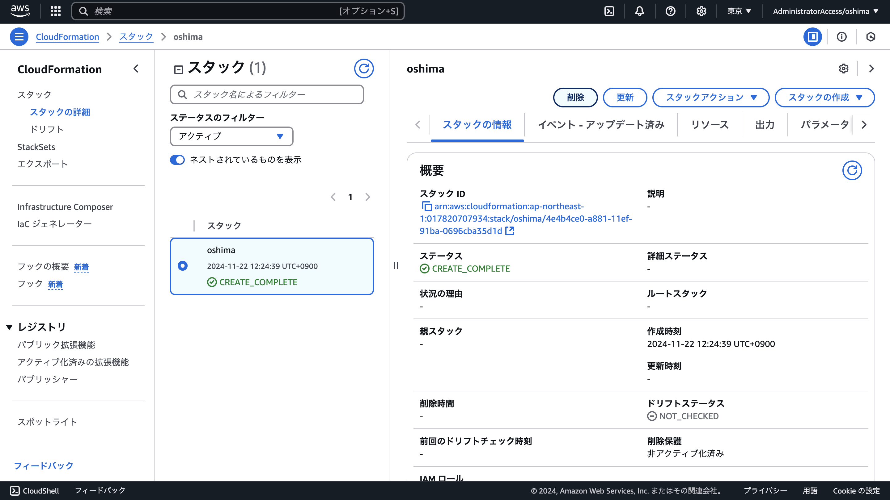

## 基本操作

### ターミナルの開き方

画面左のメニューボタン (≡) をクリックし、「ターミナル」>「新しいターミナル」でターミナルを開くことができます。


### ファイルのアップロード

ローカルからファイルをアップロードする際は、エクスプローラー (画面左のファイルのアイコン) を開いて、エクスプローラーを右クリックして「アップロード」を選択してください。

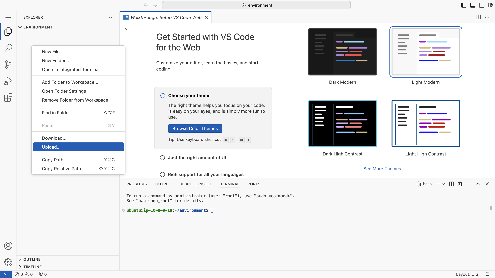

または、エクスプローラーにドラッグ & ドロップすることでもファイルをアップロードできます。

### Web アプリケーションのプレビュー (ポートの転送)

ターミナル上で Web アプリケーション等を起動した場合、画面右下に表示される「Open in Browser」をクリックするとプレビューできます。


または、`https://<ランダムな文字列>.cloudfront.net/proxy/<ポート番号>/` にアクセスすることでも、Web アプリケーションのプレビューが可能です。

## 参考

この環境構築手順は、AWS の以下のハンズオンの環境構築手順を参考にしています。

- https://catalog.us-east-1.prod.workshops.aws/workshops/a9b0eefd-f429-4859-9881-ce3a7f1a4e5f/ja-JP/setup-vscode/02-configure-ide
- https://github.com/aws-samples/code-server-setup-with-cloudformation
